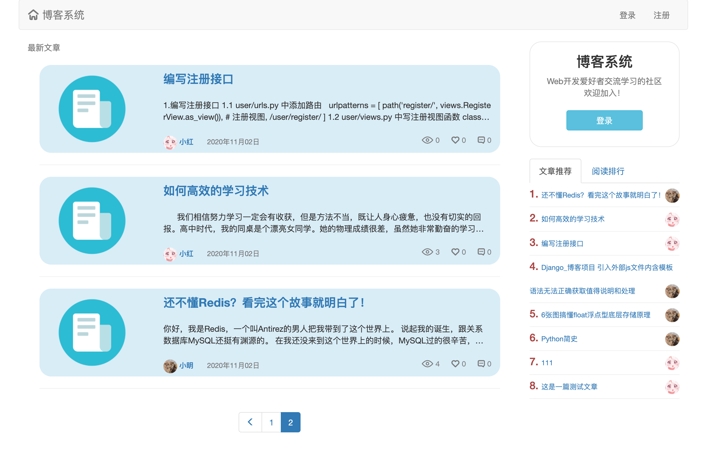
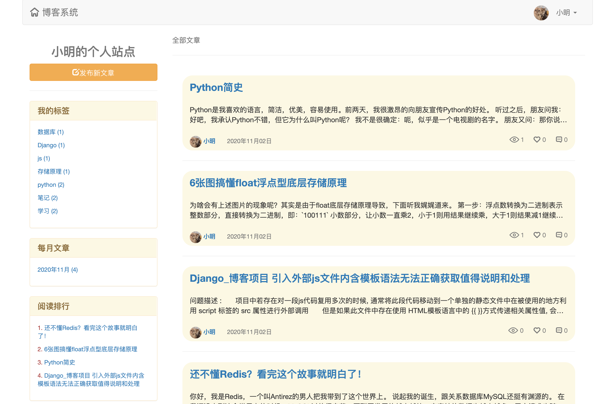
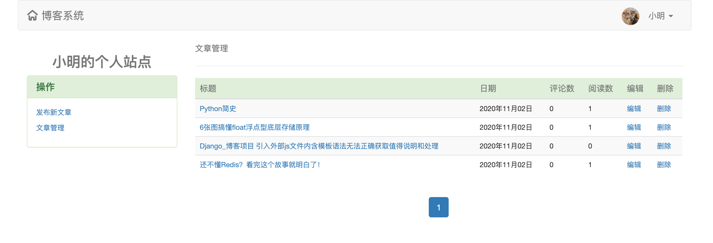
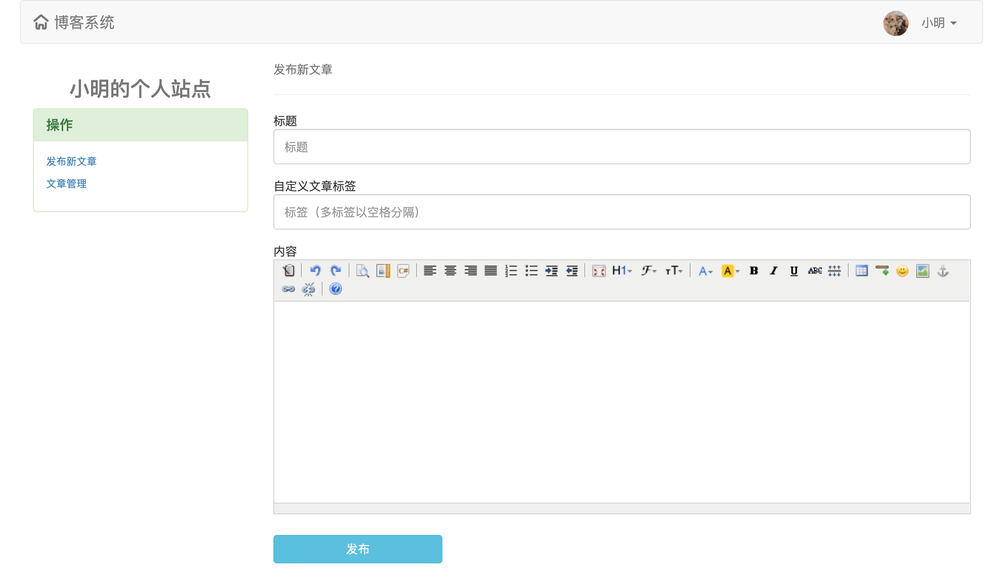
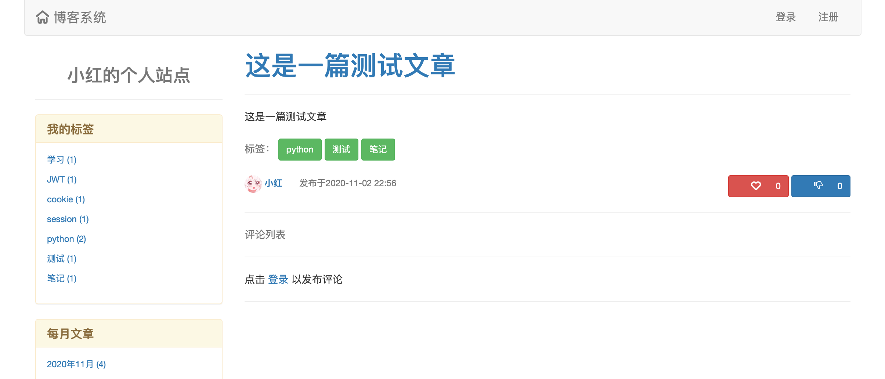
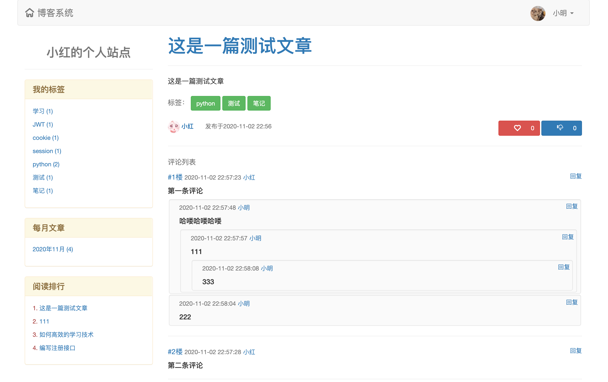

## 博客系统

### 1.[功能描述]
1. 基于ajax和auth组件实现登录验证
2. 基于ajax和forms组件实现注册功能
3. 系统首页文章列表渲染
4. 个人站点页面设计
5. 文章详情页的继承
6. 点赞与踩
7. 评论功能
8. 富文本编辑器发布文章
9. 防止xss攻击

### 2.[开发环境]
1. 操作系统：macOS10.15.7
2. 解释器版本：python3.7
3. web框架：Django3.1.1

### 3.[项目结构简介]
1. blog
   - templatetags（html模版）
   - verifyCode（验证码相关）
   - model_forms.py（初始化注册、登录相关的校验规则类）
   - models.py（初始化数据表）
   - views.py（视图函数）
2. blog_system
   - urls.py
   - settings.py
3. media（用户上传文件夹）
4. static（本地静态文件）
5. templates
   - parts（html模版）
   - base0.html
   - home.html（主页）
   - user-article.html（文章详情页）
   - user-article-create.html（新建文章）
   - user-article-change.html（修改文章）
   - user-article-manager.html（文章管理）
   - user-blog.html（个人站点）
6. manage.py

### 4.[第三方库]
1. Pillow
2. bs4

### 5.[启动方式]
1. 开启mysql数据库
    * 创建一个新库以存放表
    ```mysql
    create database db_blog;
    ```
    * 修改对应setting.py数据库连接配置
    ```python
    DATABASES = {
        'default': {
            'ENGINE': 'django.db.backends.mysql',
            'NAME': 'db_blog',  # 数据库名
            'USER': '****',  # mysql账号
            'PASSWORD': '******',  # mysql密码
            'HOST': '127.0.0.1',
            'PORT': 3306
        }
    }
    ```
2. 终端运行以下指令，生成表结构
```
python3 manage.py makemigrations
python3 manage.py migrate
```
3. 启动方式一：终端
```
python3 manage.py runserver 127.0.0.1:8080
```
4. 启动方式二：IDE
    * pycharm直接运行
5. 浏览器输入对应IP
    * http://127.0.0.1:8080/
    
### 6.[用户登录信息]
1. 进入首页即可注册账号、密码

### 7.[运行效果]
1. 系统首页

2. 个人站点

3. 文章管理

4. 文章发布

5. 文章详情页

6. 文章点赞及评论




